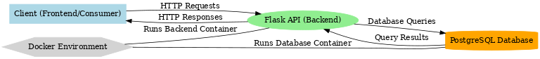

# VirtualBank

**VirtualBank** is a containerized application simulating a virtual banking system. It includes backend services for user management, bank accounts, and transactions, all powered by PostgreSQL. The frontend is currently being built using React, and the project is designed for testing, learning, and potential deployment on Google Cloud Platform (GCP).

---

## Table of Contents
1. [Overview](#overview)
2. [Features](#features)
3. [Technologies Used](#technologies-used)
4. [Setup and Installation](#setup-and-installation)
5. [Usage](#usage)
6. [Architecture](#architecture)
7. [API Documentation](#api-documentation)
8. [Contributing](#contributing)
9. [License](#license)

---

## Overview
VirtualBank is a Flask-based banking simulation project using Docker for containerization and PostgreSQL as its database. It offers basic banking functionalities like:
- User management
- Account creation
- Transactions handling

The frontend is being built with React, and future plans include hosting the entire system on Google Cloud Platform (GCP).

---

## Features
- **User Management**: Secure user registration and login.
- **Bank Accounts**: Create and manage bank accounts with encrypted account numbers.
- **Transactions**: Simulate transfers between accounts.
- **Logging and Security**: Includes token authentication and logging middleware.
- **Extensibility**: Designed for scalability and future cloud deployment.

---

## Technologies Used
- **Frontend**: React (under development)
- **Backend**: Python, Flask
- **Database**: PostgreSQL
- **Containerization**: Docker, Docker Compose
- **Security**: JWT for authentication, encryption for sensitive data
- **Cloud Deployment**: Planned for Google Cloud Platform (GCP)

---

## Setup and Installation

### Prerequisites
- Docker and Docker Compose installed
- Python 3.x (optional for local development)

### Steps
1. Clone the repository:
   ```bash
   git clone https://github.com/roisol144/VirtualBank.git
   cd VirtualBank
   ```

2. Set up environment variables:
   - Create a `.env` file in the root directory:
     ```env
     DATABASE_URL=postgresql://<user>:<password>@db:5432/<dbname>
     SECRET_KEY=<your-secret-key>
     ```

3. Build and run the Docker containers:
   ```bash
   docker compose up --build
   ```

4. Access the application:
   - Backend: `http://localhost:8000`
   - PostgreSQL: `localhost:5433` (use a database client)

---

## Usage

### Running Tests
(Optional, if tests are implemented)
```bash
pytest
```

### API Endpoints
| Endpoint               | Method | Description                |
|------------------------|--------|----------------------------|
| `/register`            | POST   | Register a new user        |
| `/login`               | POST   | Login and get a token      |
| `/accounts`            | GET    | List user accounts         |

---

## Architecture

Below is the architecture diagram of the VirtualBank system, showcasing the interactions between components:



- **Frontend**: React application (in development) that interacts with the backend via RESTful APIs.
- **Backend (Flask)**: Handles API requests, user management, and account-related operations.
- **Database (PostgreSQL)**: Stores data for users, accounts, and transactions.
- **Docker**: Manages the backend and database as separate containers for easy deployment and scaling.

---

## API Documentation
(Detailed endpoint documentation can go here or link to a separate file, e.g., `API.md`.)
- Example for `/register`:
  ```http
  POST /register
  Content-Type: application/json
  {
      "first_name": "John",
      "last_name": "Doe",
      "email": "johndoe@example.com",
      "password": "securepassword"
  }
  ```

---

## Contributing
I welcome contributions! Here's how you can get involved:
1. Fork the repository.
2. Create a feature branch (`git checkout -b feature-name`).
3. Commit your changes (`git commit -m "Description"`).
4. Push to your fork (`git push origin feature-name`).
5. Open a pull request.

---

## License
This Project MIT Licensed.

